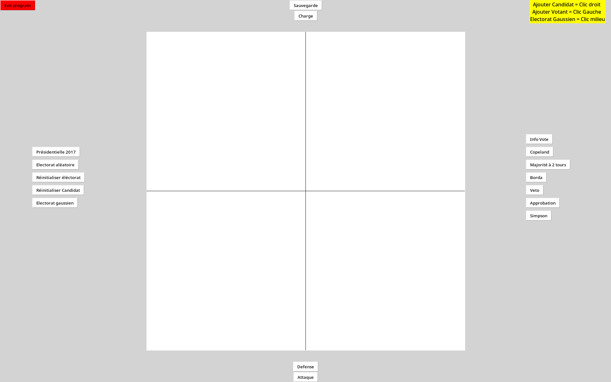
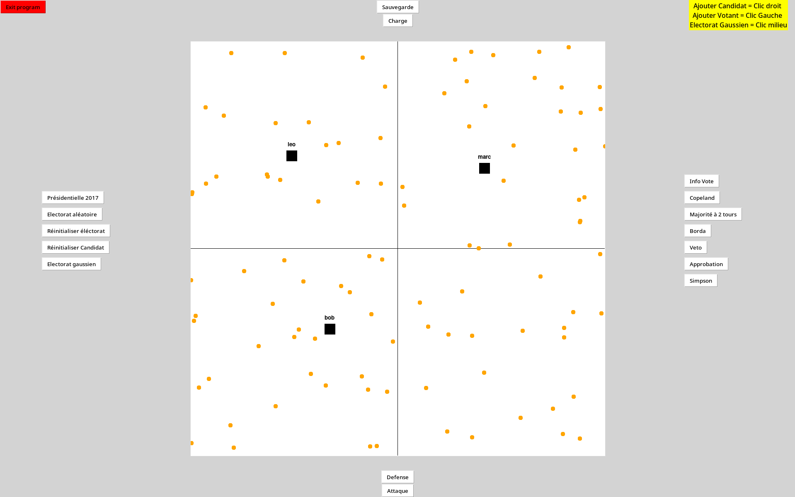
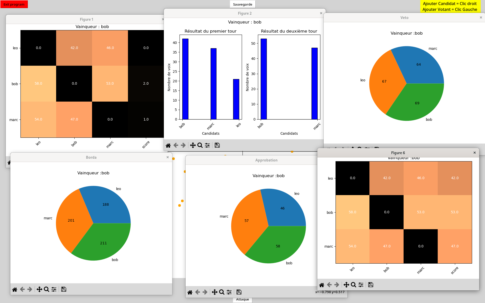
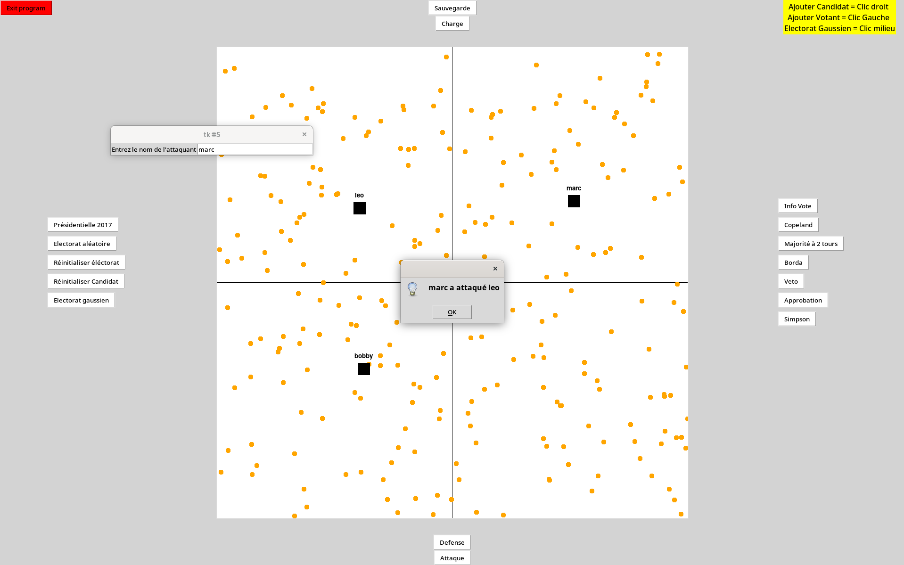

LU2IN013 – Groupe 1
Nom du groupe : GLAN
Membres : Guillaume LEBRETON / Luka BALY / Abdallah NASSUR / Nabil BATTATA


## Objectif :

L’objectif du projet est de simuler et visualiser certains processus électoraux. 
Plusieurs règles de votes doivent être comparées. Les électeurs et les candidats sont plongés dans le plan (on peut voir cela comme leurs positions selon deux axes). La proximité entre un votant et un candidat représente l’intensité de la préférence du votant pour ce candidat.

## Structure du Projet :

Le projet est structuré en 4 programmes : 

- projet_class.py : défini les classes Candidat et Votant qui vont nous permettre de créer un panel de candidat et un électorat. Ces classes vont également nous permettre  d’appliquer toutes sortes de fonctions sur nos échantillons.

- MethodesDeVote.py : défini les différentes méthodes de vote étudiées dans l’UE (Majorité à 2 tours, Borda, Copeland, Simpson, Approbation, Veto)

- interface.py : Défini la classe interface qui présente un graphique tkinter avec toutes les fonctions qui seront mis à disposition de l’utilisateur

- main.py : Qui permet de lancer l’interface pour tester les modalités du projet


## Fonctionnalités :


Notre interface graphique est composé d’un plan pour situer les candidats et les votants et de boutons reparti en 4 groupes : 

- A gauche : disposition et suppression des votants et candidats

- A droite : Les méthodes de votes, résultats affichés avec des graphes pyplot

- En haut : pour sauvegarder et charger des situations à partir de fichier txt

- En bas : méthode d’influence sur les candidats


Paramètres des classes Votant et Candidat : 

- Votant :
  
  - Nom prédéfini 
  - Coordonnées x et y
  - Dictionnaire de la distance entre ce votant et tous les candidats

- Candidat :

  - Nom choisi par le client
  - Coordonnées x et y
  - L’utilité (Score de chaque candidat par rapport à leurs distances entre chaque votant)
  - Pourcentage d’attaque choisi aléatoirement (ce pourcentage va nous permettre de définir le budget à dépenser pour l’attaque et la défense)
  - Un budget attaque pour attaquer un autre candidat (déplace aléatoirement le candidat  qui a le plus d’utilité sur le graphe)
  -  Un budget  défense pour se défendre face aux autres candidats (le candidat se déplace de telle sorte qu’il obtienne plus de voix à partir d’un rayon prédéfini) 

## Captures d'écran : 







## Exemple de code :
### classe Candidat :

```python
  class Candidat:
    #Variables associées au calcul du budget de référence
    budget = 0
    distance_relative_max = 0
    Liste_candidat = []
    def __init__(self, nom, dx, dy):
        self.nom = nom
        self.x = dx
        self.y = dy
        self.util = 0
        self.pourc_attaque = (random.randint(0,10)/10)
        self.budget_attaque = 0
        self.budget_defense =  0

        (Candidat.Liste_candidat).append(self) #avec self seul on a la liste des adresses memoire des candidats

        #Calcul du budget de référence:
        if( len(Candidat.Liste_candidat)>= 2):
            for candidat1 in Candidat.Liste_candidat:
                for candidat2 in Candidat.Liste_candidat:
                    distance_temporaire = sqrt( ( (candidat1.x)-(candidat2.x) )**2+( (candidat1.y)-(candidat2).y)**2)
                    if Candidat.distance_relative_max<=distance_temporaire:
                        Candidat.distance_relative_max = distance_temporaire

                
        Candidat.budget=1/3*Candidat.distance_relative_max
        #Fin de calcul du budget de référence

        #recalcul le bugdet de tout les candidats
        for c in Candidat.Liste_candidat :
            c.budget_attaque = c.pourc_attaque*Candidat.budget
            c.budget_defense = (1-c.pourc_attaque)*Candidat.budget


    def attaque_candidat(self,c) : 
        if self.budget_attaque == 0:
            return 0
            
        if c.nom == self.nom :
            return 1
        direction = random.uniform(0,360)
        norme = self.budget_attaque
        angle = radians(direction)
        compx = norme*cos(angle)
        compy = norme*sin(angle)
        c.x += compx
        c.y += compy
        self.budget_attaque = 0

    def Distance_indiv(self, v) : 
        return sqrt(((v.x)-(self.x))**2+((v.y)-(self.y))**2)

    def Defense_candidat(self, Electorat) : 
        if self.budget_defense == 0:
            return 0
        x_init = self.x
        y_init = self.y
        direction = [10,20,30,40,50,60,70,80,90,100,110,120,130,140,150,160,170,180,190,200,210,220,230,240,250,260,270,280,290,300,310,320,330,340,350,360]
        rayon_votants = self.budget_defense
        entourage_init = 0
        for v in Electorat : 
            if self.Distance_indiv(v) < rayon_votants : 
                entourage_init += 1
        for d in direction : 
            entourage_res = 0
            angle = radians(d)
            compx = rayon_votants * cos (angle)
            compy = rayon_votants * sin (angle)
            self.x += compx 
            self.y += compy 
            for v in Electorat : 
                if self.Distance_indiv(v) < rayon_votants : 
                    entourage_res += 1
            if entourage_res > entourage_init : 
                entourage_init = entourage_res
                x_init = self.x 
                y_init = self.y
        self.x = x_init
        self.y = y_init
        self.budget_defense = 0

    
  


 
    def utilite(self,Electorat,nbv):
        if (nbv == 0):
            return
        u = 0
        for v in Electorat:
            u += ((v.x)-(self.x))**2+((v.y)-(self.y))**2
        u = u/(nbv)**2
        self.util = u
        return u

    @staticmethod 
    def maj_util(Electorat,nbv):
        for c in Candidat.Liste_candidat:
            c.utilite(Electorat,nbv)


    def label(self):
        print("Nom:", self.nom ,"Coordonée:", self.x, ",", self.y)

    @staticmethod 
    def supp_candidat(C):
        del Candidat.Liste_candidat[C]
        print("Candidat ", C.nom, "supprimé de la liste des candidats")
    
    @staticmethod 
    def Reinitialse():
        Candidat.Liste_candidat = []

```
### méthode de vote majorité à 2 tours :
```python
  def maj2tours (listeC, listeV) : 

    print('----Majorité à 2 tours----')

    #Tour 1
    lresT1 = []
    for v in listeV : 
        lresT1.append(next(iter(v.Distance(listeC))))  #pour obtenir le candidat selectionné pour chaque votant parmi tous les candidats(le candidat le plus proche)
    dicres = {}
    for c in listeC : 
        dicres[c.nom] = countX(lresT1, c.nom)  #initialisation des resultats de chaque candidat à zero
    dicres = OrderedDict(sorted(dicres.items(), key=lambda t: t[1], reverse=True)) #dictionnaire trié dans l'ordre décroissant du nombre de voix
    ResTour1 = list(dicres.items())

    print('Résultats 1er tour :', ResTour1)

    #Tour2

    lresT2 = []
    listeC2 = []
    for k,v in list(dicres.items())[:2]: 
        for c in listeC : 
                if k == c.nom : 
                    listeC2.append(c) #liste des candidats au 2eme tour
    for v in listeV : 
        v.Réinitialiser_Distance()
        lresT2.append(next(iter(v.Distance(listeC2))))  #pour obtenir le candidat selectionné pour chaque votant parmi tous les candidats(le candidat le plus proche)

    dicres2 = {}
    for c in listeC2 : 
        dicres2[c.nom] = countX(lresT2, c.nom)  #initialisation des resultats de chaque candidat à zero
    dicres2 = OrderedDict(sorted(dicres2.items(), key=lambda t: t[1], reverse=True)) #dictionnaire trié dans l'ordre décroissant du nombre de voix
    ResTour2 = list(dicres2.items())

    print('Résultats 2eme tour :', ResTour2)

    print('Vainqueur : ', ResTour2[0][0])
    print('---------------------------')
    return ResTour1, ResTour2
    
```
